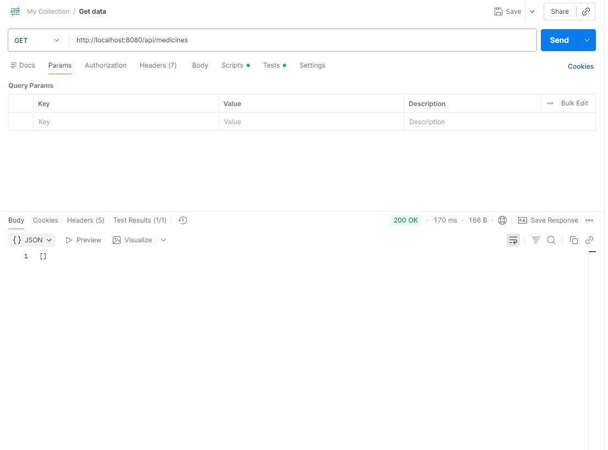
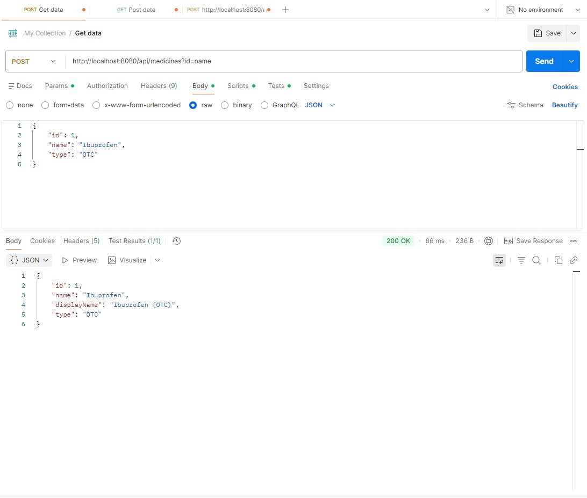
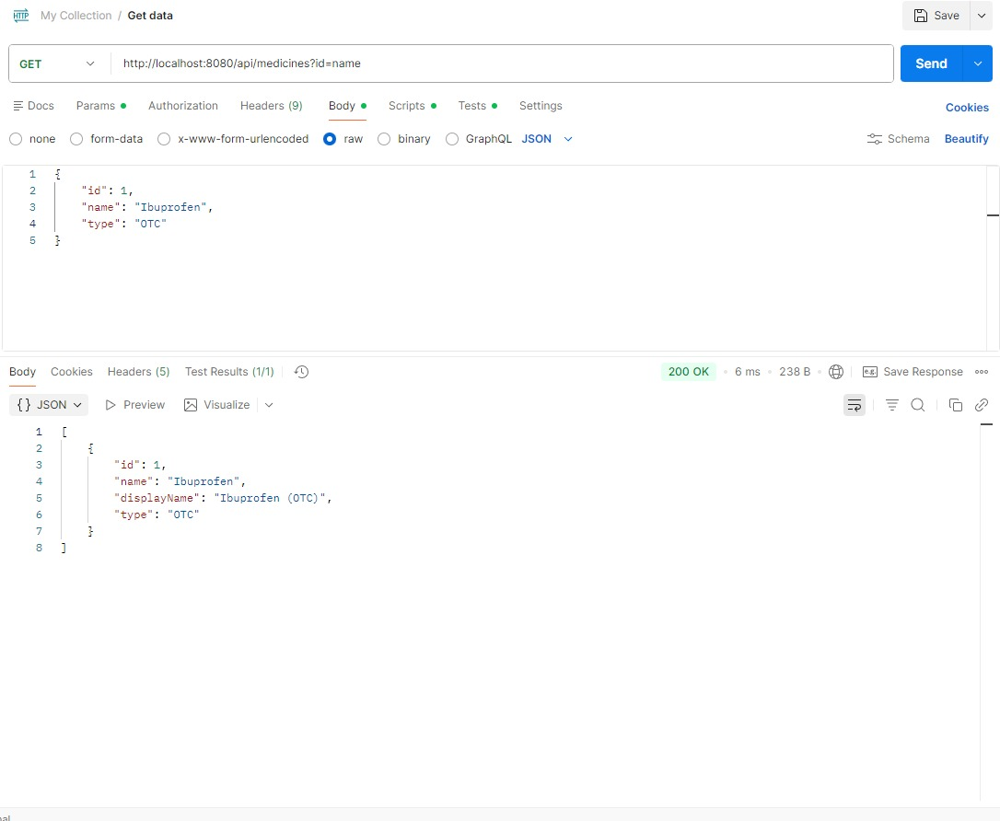
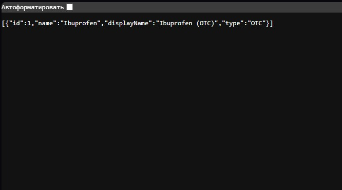
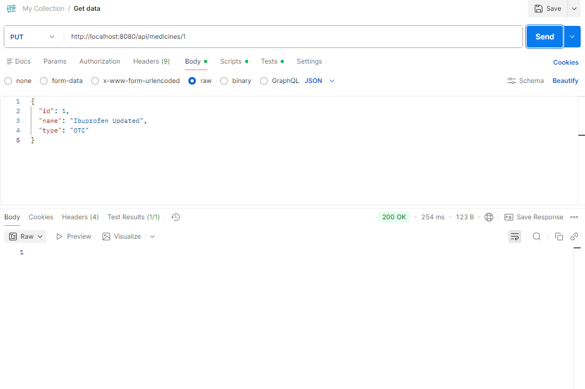
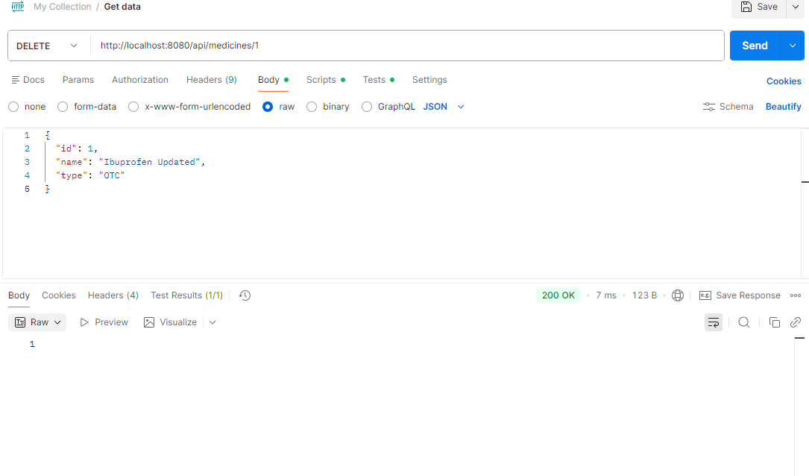
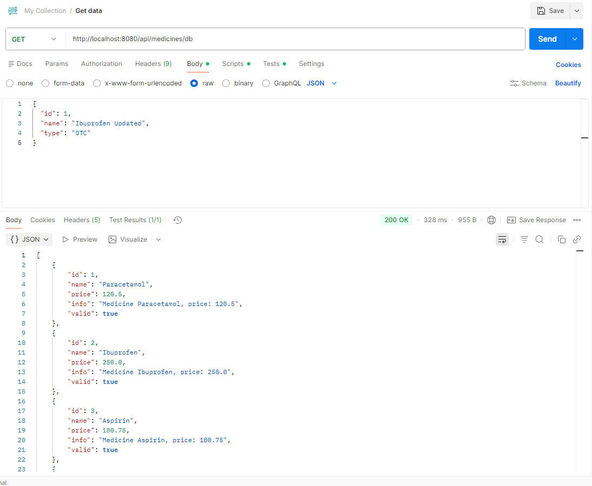

Endterm Project – Spring Boot REST API

1. Project Overview

This project is a Spring Boot RESTful API developed as an endterm assignment.
It integrates SOLID principles, design patterns, component principles, JDBC, and REST architecture into a single backend system.

The system models a pharmacy domain, allowing management of medicines via REST endpoints.

-

2. Technologies Used

Java 17

Spring Boot

Spring Web MVC

PostgreSQL

JDBC

Maven

Postman

-

3. Project Architecture

The application follows a layered architecture:

Controller → Service → Repository → Database

-

4. REST API Documentation

Base URL

http://localhost:8080/api/medicines

-

4.1 Create Medicine

POST /api/medicines

Request Body (JSON):

{
"id": 1,
"name": "Ibuprofen",
"type": "OTC"
}

Response:

200 OK

-

4.2 Get All Medicines

GET /api/medicines

Response (JSON):

[
{
"id": 1,
"name": "Ibuprofen",
"type": "OTC"
}
]

4.3 Put Medicine

[
{
"id": 1,
"name": "Ibuprofen Updated",
"type": "OTC"
}
]

4.4 Delete Medicine

5. Design Patterns

Singleton Pattern

Used implicitly by Spring for:

Service layer beans

Repository beans

Application configuration

Spring ensures a single shared instance of these components.

-

Factory Pattern

Implemented to create different medicine types (OTCMedicine, PrescriptionMedicine) based on input data.

The factory returns the base type BaseMedicine, enabling easy extension.

-

Builder Pattern

The Builder Pattern is used to construct Medicine objects with optional parameters.

-

6. Component Principles

REP – Reuse/Release Equivalence Principle

Reusable components such as repositories and services are grouped into separate packages.

-

CCP – Common Closure Principle

Classes that change together (controllers and exception handlers) are grouped within the controller layer.

-

CRP – Common Reuse Principle

Unnecessary dependencies (unused repositories and utilities) were removed to avoid forcing modules to depend on unused code.

-

7. SOLID Principles

Single Responsibility: Each layer has a single responsibility.

Open/Closed: New medicine types can be added without modifying existing logic.

Liskov Substitution: Subclasses of BaseMedicine are interchangeable.

Interface Segregation: Service interfaces expose only required methods.

Dependency Inversion: Services depend on repository interfaces, not implementations.

-

8. Exception Handling

Global exception handling is implemented using @RestControllerAdvice.

Errors are returned as meaningful HTTP responses:

400 Bad Request

404 Not Found

500 Internal Server Error

-

9. Database Configuration

The application uses PostgreSQL.

Connection is configured in application.properties.

JDBC repositories are implemented based on previous assignments.

For REST API demonstration and simplicity, I used an in-memory repository, but the database layer is fully implemented and can be integrated.

The project integrates PostgreSQL using JDBC.
A separate REST endpoint is provided to demonstrate real database access.

GET /api/medicines/db – retrieves medicine data directly from PostgreSQL.

-

10. How to Run the Project

1. Start PostgreSQL and create the database

2. Update credentials in application.properties

3. Run:

mvn spring-boot:run

4. Test endpoints using Postman

-

11. Reflection

This project demonstrates how object-oriented principles, design patterns, and REST architecture can be combined into a clean and maintainable backend system.